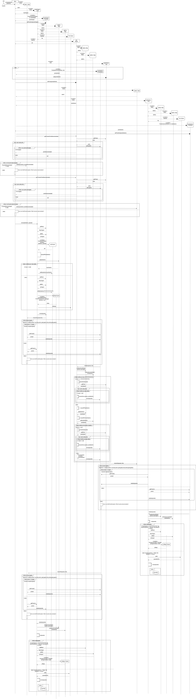
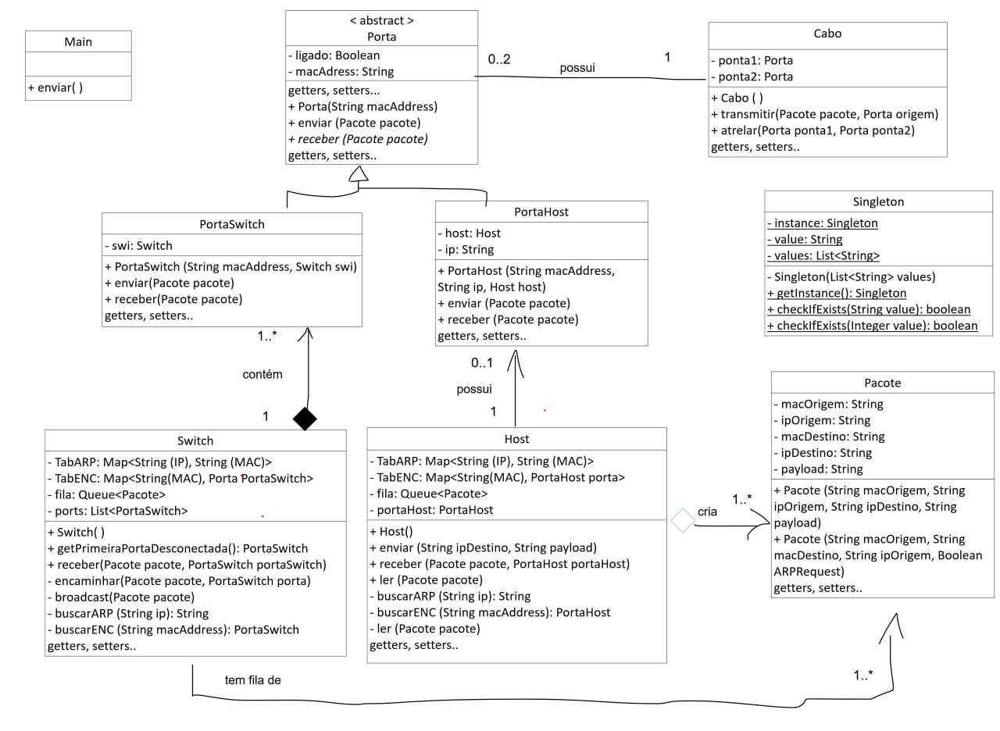

## Implementação de camada de enlace simulada, em Java

--- 
Este código tem como objetivo simular o envio simples de um pacote de um Host para um Switch, e vice-versa, considerando tabelas de ARP e encaminhamento. 

O código foi produzido por Rafael Nunes, Julio Felix e Andre Minerva para a disciplina de Redes 2 do Centro Universitário 7 de Setembro.

O código foi produzido em Java, versão 8, mas deve rodar normalmente com qualquer versão, sendo necessário apenas a instalação do Java e o uso de uma ferramenta para executar o código. Nenhuma biblioteca não nativa foi utilizada para o código e a única parte do código que não tem a ver com a camada de enlace é o uso de um Singleton para checagem de valores de MAC e IP, apenas.

O código é executado no terminal. Após o input dos dados requisitados, algumas mensagens são exibidas para auxiliar na checagem dos métodos chamados durante o código. 

Note que o diagrama só demonstra o fluxo entre um host e outro host, passando por um Switch. Também, no protocolo ARP, trata o ARP reply como unicast. Tais contextos, na vida real, podem ser alterados.

Para trabalhos futuros pode-se tornar o código mais genérico, menos engessado, mais configurável e mais reutilizável.

---
Para a criação deste projeto foram projetados dois diagramas UML. Um de classes:

E um de sequência*:

* Observação: O diagrama de sequências fornece várias possibilidades de trajeto.  Também no que, ao final, há um "recomeça". Neste caso, dependendo da situação, como no caso da criação de novo pacote para envio, o fluxo não é recomeçado do extremo começo, devendo o fluxo ser acompanhado a partir do << create >> Pacote (), no host origem.

E um de classes: 

